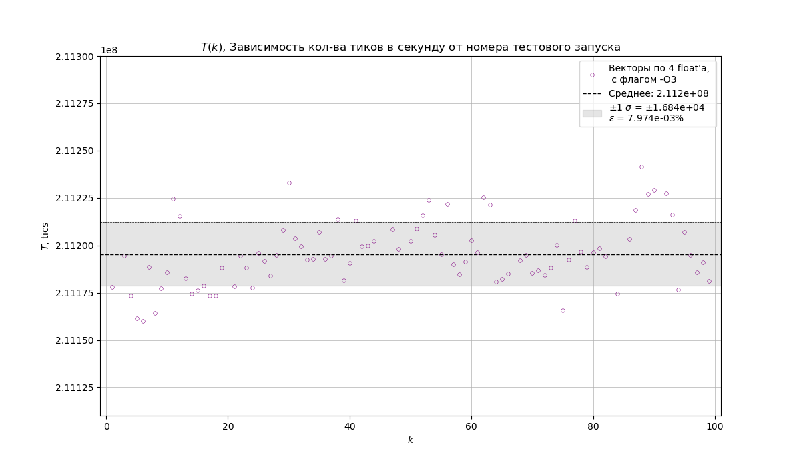
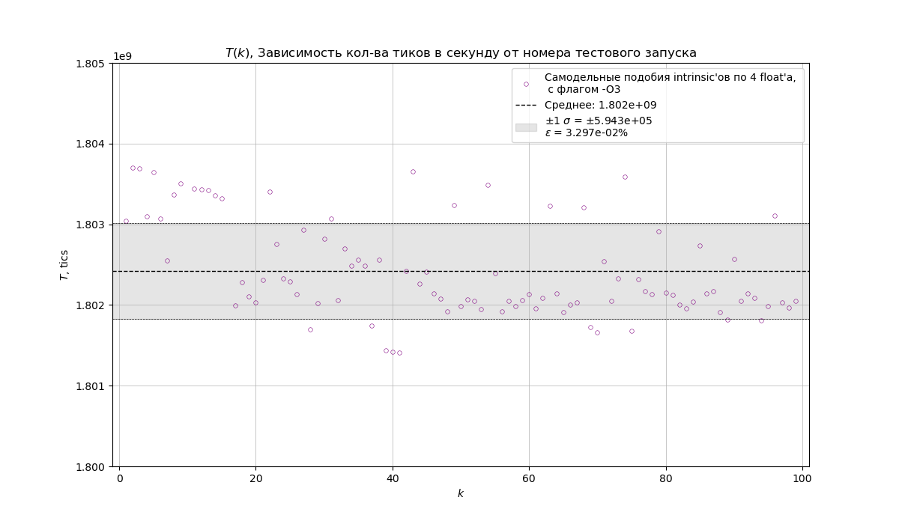

# Оптимизация программы, рисующей множество Мандельброта

## Введение 

Я столкнулсяс задачей: написать программу, рисующую множества Мандельброта, а также рааазными путями как-можно больше ускорить процесс расчёта и отрисовки этого множества.

## Ход работы 

1) Для отрисовки картинки мною использовалась графическая библиотека SFML. Для отрисовки картики, в цикле обрабатывания кадров, в каждой итерации вызывается заполнение массива с цветом каждого пикселя отображаемог окна.    

2) Написал первую версию программы. В ней координаты каждой точки множества расчитываются по-отдельности, никакие оптимизации не применялись.   

    $\qquad\qquad\qquad\qquad$ Замерение времени работы для программы в тактах процессора: 
    

$\qquad$ В тестовом запуске не включалась графика, поэтому оценка времени учитывает только затраты на расчёт и помещение точек в массив с цветами.

3) Заметил, что точки множества зависят только от своего начального положения и номера итерации, на которой онинаходятся, но никак не зависят друг от друга. Из этого сделал вывод, что можно упаковать точки в вектора по 4 значения и расчитывать параллельно. Конечно же это не случайный выбор, надежды возлагались на то, что, под флагом компиляции -O2 или -O3 компилятор заменит конструкции с такими векторами на [интрински](https://en.wikipedia.org/wiki/Intrinsic_function), являющиеся реализацией [SIMD](https://ru.wikipedia.org/wiki/SIMD)-раширения Intel. 

    $\qquad\qquad\qquad\quad$ Аналогичное замерение времени работы для второй версии програмы: 

$\qquad$ Как видно, эта оптимизация дала прирост больше, чем в два раза.

4. На этой стадии Я ещё не решился использовать оригинальные интринсики, и, дабы упростить переход к их использованию, решил написать их аналоги на С.   

    $\qquad\qquad\qquad\qquad\qquad$ Замерение времени для третьей версии программы:

$\qquad$ Как видно по результатам замера времени(замедление относительно базового варианта в ~3.5 раза ) этот этап нёс чисто обучительный характер. По всей видимости ухудшение связано с тем, что компилятор не распознал в моих функциях возможности их сворачивания в конструкции с параллельными вычислениями.  

5. Перешёл, наконец, к использованию оригинальных интринсиков ( AVX, AVX2 - инструкции ). Их преимущество в том, что на уровне ассемблерного кода, каждый интринсик представляется одной ассемблерной командой (при условии указания флага -O2 или -O3 при компиляции), манипулирующей с XMM-регистрами полностью или их младшими битами.

    $\qquad\qquad\qquad\qquad\qquad$ Замерение времени для четвёртой версии программы:

$\qquad$ Как видно по графику, ускорение, относительно первого варианта больше, чем в 3.5 раза. Успех! Это означает, что интнринсики действительно работают.

6. С удивлением Я обнаружил, что мой процессор поддерживает технологию AVX2. Это означает, что можно производить операции с векторами по восемь чисел с плавающей запятой одинарной точности. Обрадовался этому факту, переписал проргамму, исползуя эти интринсики, и получил следующие результаты. 

    $\qquad\qquad\qquad\qquad\qquad$ Замерение времени для пятой версии программы:

$\qquad$ Ускорение почти в 7 раз, относительно первого варианта программы !

# Заключительное сравнение 

|              |время работы (в тиках)  |       Отн. погр.       |           fps
|--------------|:----------------------:|:----------------------:|:----------------------:|
|без оптимизации        |__(50524 +- 3) * 10 ^4__|__(6 * 10 ^-3)__|__(6.3)__|
|векторы по 4 float'а   |__(21120 +- 2) * 10 ^4__|__(8 * 10 ^-3)__|__(15.2)__|
|палёные интринсики     |__(18024 +- 6) * 10 ^5__|__(8 * 10 ^-2)__|__(1.8)__|
|оригинальные интринсики|__(13604 +- 2) * 10 ^4__|__(1 * 10 ^-2)__|__(23.5)__|
 по 4 float'а           
|оригинальные интринсики|__(7441 +- 1) * 10 ^4__|__(2 * 10 ^-2)__|__(43.0)__|
|по 8 float'ов         

### Итоговое ускорение = 6.8 раз

    
$\qquad\qquad\qquad\qquad\qquad\qquad$ Общий график для наглядности:

# Вывод 
SIMD-инструкциии могут быть полезны при опимизации параллельных операций с независящими друг от друга данными. В таком случае их можно упаковать в вектора по четыре или восемь значений (а с технологей AVX-512 ещё и по 16). Но от этого код становися тяжело воспринимать, программу становиться тяжелее дебажить, а самое главное - программа становиться зависимой от железа, то есть нет гарантии, что она с лёгкостью перенесётся на другое устройство и будет без проблем выполняться.  
